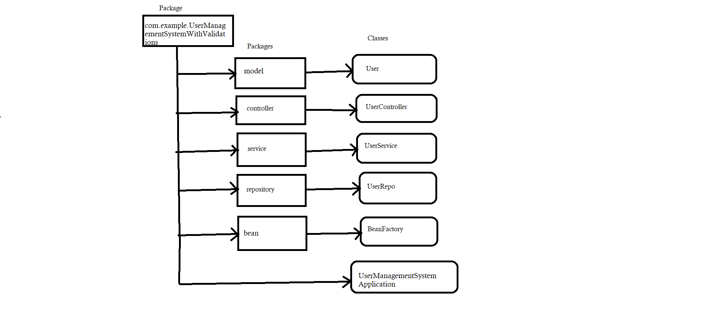

## Frameworks and language used 
* SpringBoot Framework and java language.
## Data Flow

## Data Structure used in your project
* Arraylist
## Project Summary

This is the "User Management System" Application which following the mvc-Architecture. I have created a package of springBootUserManagementSystemApplicationWithValidations within this package I have created Five more packages to define layer as given in DFD. In this project a User has specific Id ,name ,DOB ,Email ,phone Number ,Date ,Time  which giving the whole information of the user.
So here we are validating the data with the help of validations by performing crud operations on it with the help of endpoints like @GetMapping to get all the information of the user, @PostMapping to create a User using the attributes,
@PuMapping to update the perticular User information using their Id, @deleteMapping to remove a User from list by giving specific Id.That's the whole project meant. 